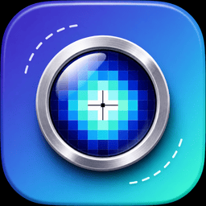

<p align="center">
  
</p>

<h1 align="center">ZoomShot</h1>

A tiny macOS screenshot utility that pops a magnifier loupe under the cursor when you start an area selection — so you can pinpoint the exact pixel to drag from. Press **⌘⇧5**, see an 8× live magnifier follow your cursor, drag a region, release. The cropped PNG lands on the clipboard and a thumbnail floats up in the bottom-right.

## Build

```bash
./build.sh release        # produces ZoomShot.app in the repo root
open ZoomShot.app         # launches the menu bar app
```

Requires macOS 14+ and Xcode 15+ command-line tools (for Swift 5.9 + ScreenCaptureKit).

## First-launch setup

1. **Grant Screen Recording permission.** The first capture attempt triggers a system prompt — say yes, then relaunch ZoomShot.
2. **Free up ⌘⇧5.** macOS owns this combo by default. Open
   *System Settings → Keyboard → Keyboard Shortcuts → Screenshots*
   and uncheck **Screenshot and recording options** (or rebind it).

## Use

- Menu bar icon (`◉`) → **Capture Area** — or just press ⌘⇧5.
- Move the cursor; the loupe shows pixels at 8× with a 1-pixel crosshair on the exact center.
- Click-drag to pick a region; release to capture.
- **Esc** at any point cancels.

## Layout

```
Sources/ZoomShot/
├── App/          # entry, menu bar, Carbon hotkey
├── Capture/      # ScreenCaptureKit snapshot + pixel cropping
├── Overlay/      # full-screen overlay window, drag rect, loupe
├── Output/       # clipboard write, thumbnail floater
└── Coordinator/  # ties the flow together
```

## Status

v0.1 — single primary display only. Multi-monitor, scroll-to-zoom, color readout, and a preferences UI are out of scope until v0.2.
